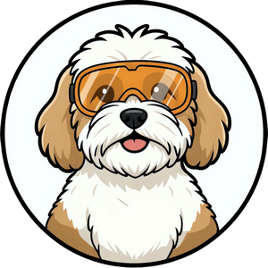
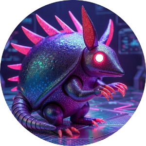

# CanvasGreyscale (Code Name: Armadillo)
**A companion script to prep high-contrast canvases for Fusion's Project Salvador.**

 

## Introduction: The "Why" and "What"

Fusion's Project Salvador add-in is a fantastic tool for generating sketches from canvas images, but it currently lacks a threshold adjustment feature. Because of this, it can struggle to find clean edges on color images, especially those with lighter colors or lower resolutions. 

**CanvasGreyscale** is a simple utility designed to bridge that gap. By converting your images to 8-bit greyscale (and back to RGB for texture compatibility) *before* dropping them onto the canvas, you provide Project Salvador with the contrast it needs to generate much cleaner, more accurate sketches—without having to pre-process your images in a separate editing app.

* **Feature 1:** Native selection filtering ensures you only place canvases on valid planar faces or construction planes.
* **Feature 2:** Automatically installs and utilizes the Python Pillow library to instantly desaturate the selected image.
* **Feature 3:** Generates a permanent greyscale copy of your image and seamlessly imports it into your active design at a default 50% opacity, ready for tracing or Project Salvador generation.

## Installation

### Manual Installation Options

This script requires a quick manual installation. You can choose to install it in Fusion's default scripts directory or a custom folder of your choice.

#### Option 1: Install in the Default Fusion Directory
1. **Download:** Download the source code as a ZIP file and extract the `CanvasGreyscale` folder.
2. **Move the Folder:** Move the entire `CanvasGreyscale` folder into your native Fusion Scripts directory:
   * **Windows:** `%appdata%\Autodesk\Autodesk Fusion 360\API\Scripts`
   * **Mac:** `~/Library/Application Support/Autodesk/Autodesk Fusion 360/API/Scripts`
3. **Open Fusion:** Press `Shift + S` to open the **Scripts and Add-Ins** dialog.
4. **Run the Script:** Make sure the **Scripts** filter checkbox is checked. You should see **CanvasGreyscale** in the list of scripts. Click the **Run** icon to execute the script.

#### Option 2: Install in a Custom Directory
1. **Download:** Download the source code as a ZIP file and extract the `CanvasGreyscale` folder.
2. **Organize:** Create a dedicated folder on your computer for your Fusion tools (e.g., `Documents\Fusion_Tools`) and move the `CanvasGreyscale` folder inside it.
3. **Open Fusion:** Press `Shift + S` to open the **Scripts and Add-Ins** dialog.
4. **Add the Script:** Click the grey **"+"** icon next to the search box at the top of the dialog and select **Script or add-in from device**.
5. **Locate:** Navigate to your custom folder, select the `CanvasGreyscale` folder, and click **Select Folder**.
6. **Run the Script:** Make sure the **Scripts** filter checkbox is checked. You should now see **CanvasGreyscale** listed. Click the **Run** icon to execute the script.

## Using CanvasGreyscale

Running the script launches a native, two-step Fusion workflow:

* **Step 1 (Select Plane):** Click on any construction plane or planar face in your active design to define where the canvas will live.
* **Step 2 (Select Image):** Use the standard file dialog to select your source `.png`, `.jpg`, `.jpeg`, or `.bmp` file.

The script will handle the conversion in the background, automatically select the canvas for you, and display a success dialog when it is finished.

* **Tip:** The script automatically generates a permanent `_greyscale.png` copy of your processed image right next to your original file. This prevents OS file-locking issues, keeps Fusion happy, and keeps your project assets neatly organized together!

## Tech Stack

For the fellow coders and makers out there, here is how CanvasGreyscale was built:

* **Language:** Python (Fusion API)
* **Interface:** Native Fusion UI (Entity Selection and File Dialogs)
* **Data Storage:** Standard OS path manipulation (saving a persistent local copy to ensure 3D viewport stability).

## Acknowledgements & Credits

* **Developer:** Ed Johnson ([Making With An EdJ](https://www.youtube.com/@makingwithanedj))
* **AI Assistance:** Developed with coding assistance from Google's Gemini.
* **Lucy (The Cavachon Puppy):**
***Chief Wellness Officer & Director of Mandatory Breaks***
    * Thank you for ensuring I maintained healthy circulation by interrupting my deep coding sessions with urgent requests for play.
* **License:** Creative Commons Attribution-NonCommercial-ShareAlike 4.0 International License.

---

## Support the Maker (and Lucy!)

I develop these tools to improve my own parametric workflows and love sharing them with the community. If you find LiveUtilities useful and want to say thanks, feel free to **[buy Lucy a dog treat on Ko-fi](https://ko-fi.com/makingwithanedj)**! This is completely optional and supports my Chief Wellness Officer in maintaining mandatory play breaks. Your appreciation and feedback are more than enough.

***

*Happy Making!*
*— EdJ*